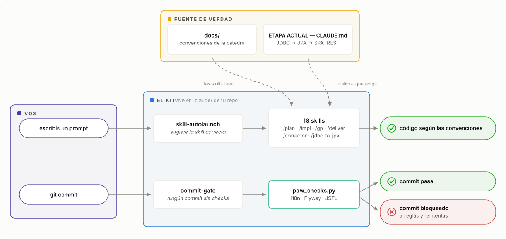
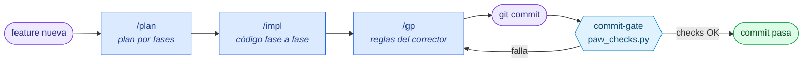
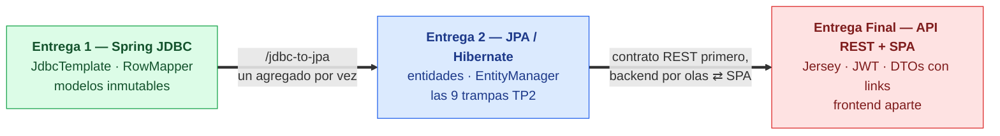
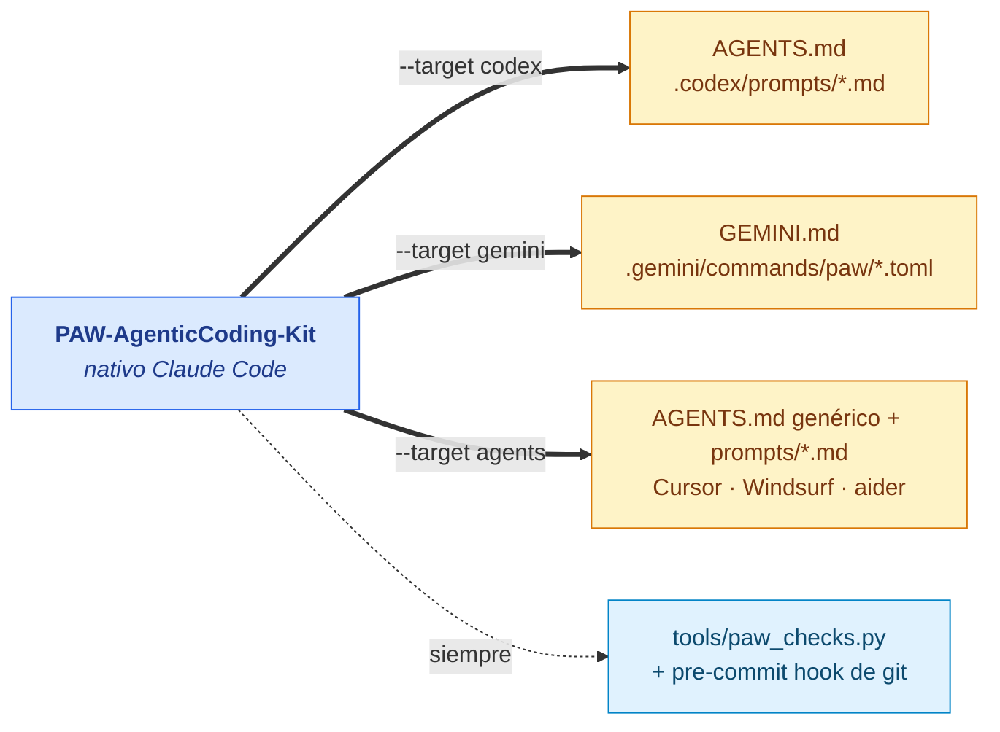

# PAW-AgenticCoding-Kit

Tooling de agentic coding para cursar PAW (Proyecto de Aplicaciones Web, ITBA): 18 skills,
4 hooks, checks determinísticos, las convenciones de la cátedra, guías por etapa
(JDBC → JPA → SPA+REST) y un exportador a otros agentes. Es nativo de Claude Code y se
instala con un comando.

El kit sale del TP del Grupo 10 (2026-1C, "Rent The Slopes"). Una auditoría de ~113 sesiones
de Claude Code sobre ese proyecto mostró dónde se perdía más tiempo: keys de i18n que rompen
en runtime, migraciones Flyway duplicadas después de un merge, iteración visual a ciegas,
auditorías que repiten falsos positivos ya descartados, tests verdes con la app rota. Cada
pieza del kit ataca uno de esos problemas, y todo se usó durante la cursada real.

## Índice

- [El kit de un vistazo](#el-kit-de-un-vistazo)
- [Instalación](#instalación)
- [El día a día con el kit](#el-día-a-día-con-el-kit)
- [Etapas de la cursada](#etapas-de-la-cursada-jdbc--jpa--sparest)
- [Qué incluye](#qué-incluye): [hooks](#hooks), [skills](#skills), [docs](#docs)
- [Usarlo con otros agentes](#usarlo-con-otros-agentes)
- [Cómo funciona por dentro](#cómo-funciona-por-dentro)
- [Adaptarlo a otro proyecto](#adaptarlo-a-otro-proyecto--otra-cátedra)
- [Limitaciones](#limitaciones)

## El kit de un vistazo

<picture>
  <source media="(prefers-color-scheme: dark)" srcset="assets/kit-overview-dark.svg">
  
</picture>

Tu prompt entra por el hook que sugiere la skill correcta, y las skills leen las convenciones
y la etapa declarada para decidir qué exigir. Tu commit pasa por el gate, que corre los checks
determinísticos antes de dejarlo seguir. Son cuatro tipos de pieza:

| Pieza | Qué es | Cuándo actúa |
|---|---|---|
| Hooks | Automatizaciones python que corren fuera del modelo | Solas: al escribir un prompt, editar un bundle, commitear |
| Skills | Comandos `/algo` con las reglas de la cátedra encodeadas | Cuando las invocás (o el hook te las sugiere) |
| Checks | Script determinístico (`paw_checks.py`) | Lo usan hooks y skills; también corre a mano |
| Docs + etapas | Convenciones de la cátedra y reglas por entrega | Las skills las leen como fuente de verdad |

## Instalación

Requisitos:

- [Claude Code](https://claude.com/claude-code)
- `python3` (hooks y checks usan solo la biblioteca estándar, sin dependencias)
- un proyecto PAW con la estructura estándar de la cátedra: Maven multi-módulo (`models`,
  `persistence-contracts`, `persistence`, `service-contracts`, `services`, `webapp`),
  Spring MVC + JSP, PostgreSQL + Flyway, HSQLDB para tests, i18n en
  `webapp/src/main/resources/i18n/`

```bash
git clone <este-repo> paw-claude-kit
cd paw-claude-kit
./install.sh /ruta/a/tu/repo-paw              # tooling
./install.sh /ruta/a/tu/repo-paw --with-docs  # tooling + convenciones en docs/
```

El instalador copia `claude/{skills,hooks,scripts}` a `<tu-repo>/.claude/` y mergea
[`settings-fragment.json`](settings-fragment.json) en tu `settings.local.json`: suma permisos
sin pisar los tuyos, pero los hooks del kit reemplazan el evento homónimo (si ya tenías hooks
propios en ese evento, revisá el merge). Después cerrá y volvé a abrir Claude Code en el
repo: los hooks se cargan al arrancar la sesión.

<details>
<summary>Alternativa: instalarlo desde Claude Code, sin correr el script</summary>

Pegale esto a Claude Code parado en tu clon del proyecto:

```
Instalá el tooling de Claude Code desde <ruta>/paw-claude-kit:
1) Copiá el contenido de claude/ (skills/, hooks/, scripts/) adentro de .claude/ de este repo.
2) Mergeá settings-fragment.json dentro de mi .claude/settings.local.json: el bloque "hooks"
   completo, y sumá a "permissions.allow" lo que no tenga — más mis permisos de Edit/Write
   para la ruta de ESTE clon.
3) Verificá: python3 .claude/scripts/paw_checks.py all debe dar i18n/flyway/jsp OK y los
   4 hooks deben parsear.
4) Leé el README del kit y explicame en una línea por elemento qué es cada cosa y cuándo
   la uso. Aclarame que los hooks recién se activan en la PRÓXIMA sesión.
```
</details>

## El día a día con el kit



| Momento | Qué hacés |
|---|---|
| Arranque de cursada | Declarar `ETAPA ACTUAL: JDBC (Entrega 1)` en tu `CLAUDE.md` (ver [`etapas/`](etapas/README.md)) |
| Feature nueva | `/plan` → `/impl` → `/gp` → commit (el gate corre solo) |
| Llega la Entrega 2 | `/jdbc-to-jpa fase-0` → `/jdbc-to-jpa <agregado>` (uno por vez) → `ETAPA: JPA` |
| Llega la Final | Contrato REST en `0_Plans/` → olas backend ⇄ SPA ([guía](etapas/entrega-final-spa-rest.md)) → `ETAPA: SPA+REST` |
| Ajuste visual | `/enhance` (la skill verifica el render antes de dar por terminado) → `/i18n` |
| Chequeo rápido | `/smoke` (sanidad en menos de 2 minutos, solo reporta) |
| Antes de entregar | `/smoke` → `/deliver` → `/corrector` |
| Encontraste un bug | `/bug <síntoma>` — Claude consulta el ledger antes de re-diagnosticar |
| Te quedaste sin tokens | `/handoff` — prompt de reanudación para la próxima sesión |

## Etapas de la cursada: JDBC → JPA → SPA+REST

PAW cambia de reglas en cada entrega: auditar un TP1 con reglas de Hibernate, o una SPA con
reglas de JSP, genera falsos positivos. Por eso el kit lee la etapa declarada en tu
`CLAUDE.md`, y las skills de planificación y auditoría ajustan qué exigir.



```markdown
## Etapa de la cursada          ← esto va en el CLAUDE.md de tu repo
ETAPA ACTUAL: JDBC (Entrega 1)  ← o «JPA (Entrega 2+)» / «SPA+REST (Entrega Final)»
```

| Doc | Qué cubre |
|---|---|
| [`entrega-1-jdbc.md`](etapas/entrega-1-jdbc.md) | Reglas de la etapa JDBC (RowMapper estático, SimpleJdbcInsert, modelos inmutables, escape de LIKE) y qué reglas JPA no aplican todavía |
| [`migracion-jdbc-a-jpa.md`](etapas/migracion-jdbc-a-jpa.md) | Playbook de la migración: fase 0 de infra, orden por agregado (hojas primero), checklist por DAO. Se ejecuta con la skill [`jdbc-to-jpa`](claude/skills/jdbc-to-jpa/SKILL.md) |
| [`entrega-2-jpa.md`](etapas/entrega-2-jpa.md) | Las 9 trampas TP2 de Hibernate (EAGER cascada, modelo 1+1, `@Async`+lazy, `em.flush()`...) y qué cambia respecto de la Entrega 1 |
| [`entrega-final-spa-rest.md`](etapas/entrega-final-spa-rest.md) | JSP → API REST + SPA: el contrato primero, backend por olas (Jersey `/api/*`, JWT stateless, DTOs con links, paginación por headers, ExceptionMappers), SPA pantalla por pantalla, y la tabla de qué regla JSP muere y cuál la reemplaza |

Empezá por [`etapas/README.md`](etapas/README.md).

## Qué incluye

### Hooks

Corren solos, sin que los invoques:

| Archivo | Evento | Qué hace |
|---|---|---|
| [`skill-autolaunch.py`](claude/hooks/skill-autolaunch.py) | `UserPromptSubmit` | Sugiere la skill correcta según tu prompt ("antes de entregar" → `/pre-delivery`, "se ve feo" → `/enhancer`, "auditá el proyecto" → `/general-audit`), con guards para no disparar en falso |
| [`i18n-parity-posttool.py`](claude/hooks/i18n-parity-posttool.py) | `PostToolUse` | Si Claude edita un `messages*.properties` y deja keys cojas, se lo marca en el mismo turno |
| [`commit-gate.py`](claude/hooks/commit-gate.py) | `PreToolUse` | Todo `git commit` corre los checks primero; si fallan, bloquea el commit con el detalle. Bypass: `PAW_SKIP_SMOKE=1 git commit ...` |
| [`db-server-guard.py`](claude/hooks/db-server-guard.py) | `PreToolUse` | Impide que Claude corra `psql`/`pg_*`/`jetty:run` por su cuenta; lo obliga a darte el comando listo para copiar, con preview antes de lo destructivo. Bypass: `PAW_ALLOW_DB=1` |

`commit-gate` e `i18n-parity` se apoyan en [`paw_checks.py`](claude/scripts/paw_checks.py), el
script de checks determinísticos que corre en segundos: paridad de keys i18n entre los 4
bundles (una key coja es una `JasperException` en runtime), versiones Flyway duplicadas (la
app no bootea) y balance de tags JSTL en JSPs (un 500 que `mvn test` no atrapa).
[`settings-fragment.json`](settings-fragment.json) registra los 4 hooks más una allowlist de
permisos frecuentes (mvn, grep, git).

### Skills

Comandos `/algo` que se invocan desde la sesión:

<details open>
<summary>Planificar y codear</summary>

| Skill | Comando | Qué hace |
|---|---|---|
| [`feature-engineering`](claude/skills/feature-engineering/SKILL.md) | `/feature-engineering` | Entrevista de descubrimiento: de una idea vaga a una spec implementable |
| [`planning`](claude/skills/planning/SKILL.md) | `/plan` | Plan fase a fase de una feature (models → persistence → services → validators → controllers → views → tests) |
| [`implementation`](claude/skills/implementation/SKILL.md) | `/impl` | Ejecuta un plan fase por fase respetando las convenciones del curso |
| [`jdbc-to-jpa`](claude/skills/jdbc-to-jpa/SKILL.md) | `/jdbc-to-jpa` (alias `/migrate`) | Migra la persistencia JDBC → JPA un agregado por vez (entidades, JpaDao, 1+1, tests con `em.flush()`, swap de bean) |
</details>

<details open>
<summary>Calidad y auditorías</summary>

| Skill | Comando | Qué hace |
|---|---|---|
| [`good-practice`](claude/skills/good-practice/SKILL.md) | `/gp` | Chequea lo modificado contra las reglas del corrector (XSS, ownership, `Mockito.verify`, N+1, trampas Hibernate). Después de codear, antes de commitear |
| [`smoke`](claude/skills/smoke/SKILL.md) | `/smoke` | Sanidad en menos de 2 minutos: checks + test-compile. Solo reporta, no arregla |
| [`pre-delivery`](claude/skills/pre-delivery/SKILL.md) | `/deliver` | Checklist completo de pre-entrega, build y tests; integra los chequeos de XSS y ownership |
| [`corrector-eyes`](claude/skills/corrector-eyes/SKILL.md) | `/corrector` | Simula al corrector con tolerancia cero y estima puntos en riesgo |
| [`forensic-audit`](claude/skills/forensic-audit/SKILL.md) | `/audit` | Auditoría forense profunda con agentes paralelos por feature |
| [`general-audit`](claude/skills/general-audit/SKILL.md) | `/general` | Auditoría en dos pasadas (vertical y horizontal) con dictamen |
| [`i18n-sync`](claude/skills/i18n-sync/SKILL.md) | `/i18n` | Diff fino de bundles: keys sin definir, huérfanas, textos hardcodeados |
</details>

<details open>
<summary>Frontend / UI</summary>

| Skill | Comando | Qué hace |
|---|---|---|
| [`design`](claude/skills/design/SKILL.md) | `/design` | UI nueva o rediseño dentro del design system; verifica el renderizado antes de dar por terminado |
| [`enhancer`](claude/skills/enhancer/SKILL.md) | `/enhance` | Retoque estético liviano de JSP/CSS sin tocar funcionalidad |
| [`frontend-analyzer`](claude/skills/frontend-analyzer/SKILL.md) | `/frontend-analyzer` | Análisis del diseño de una página local, del que sale una spec de tokens y componentes |
</details>

<details open>
<summary>Sesión, bugs y meta</summary>

| Skill | Comando | Qué hace |
|---|---|---|
| [`bug`](claude/skills/bug/SKILL.md) | `/bug` | Ledger de bugs en `0_Plans/BUGS.md`: síntoma verbatim e intentos fallidos, para que un bug se explique una sola vez |
| [`handoff`](claude/skills/handoff/SKILL.md) | `/handoff` | Cierre de sesión reanudable: estado y prompt de reanudación auto-contenido (session limits, cambio de modelo) |
| [`wiki-sync`](claude/skills/wiki-sync/SKILL.md) | `/wiki` | Sincroniza un wiki de Obsidian con la codebase (opcional; ajustá la ruta del wiki en su SKILL.md) |
| [`skillset-port`](claude/skills/skillset-port/SKILL.md) | `/port` | Adapta todo el set a otro proyecto o stack (detecta, entrevista, reescribe) |
</details>

El índice completo del set (categorías, workflows, guía de portabilidad) está en
[`claude/skills/README.md`](claude/skills/README.md).

### Docs

15 documentos en [`docs/`](docs/) que las skills de auditoría usan como fuente de verdad:
[`testing.md`](docs/testing.md) (las reglas de tests que la cátedra corrige de verdad),
[`anti-patterns.md`](docs/anti-patterns.md) (checklist negativo consolidado de 27+ grupos),
[`correcciones-cohorte.md`](docs/correcciones-cohorte.md) (todo lo que descontó el corrector
en TP1 y TP2), [`security.md`](docs/security.md), [`views-and-jsp.md`](docs/views-and-jsp.md),
[`pagination-and-search.md`](docs/pagination-and-search.md), entre otros.

Copialos a tu repo con `--with-docs` y adaptá lo específico del Grupo 10 (nombres de clases,
notas, findings propios) a tu proyecto. Importalos desde tu `CLAUDE.md` con `@docs/<archivo>.md`.

## Usarlo con otros agentes

El kit es nativo de Claude Code, pero casi todo es texto, así que un exportador lo traduce a
otros formatos:

```bash
python3 tools/export.py --target codex  --out /ruta/a/tu/repo   # AGENTS.md + .codex/prompts/
python3 tools/export.py --target gemini --out /ruta/a/tu/repo   # GEMINI.md + .gemini/commands/paw/*.toml
python3 tools/export.py --target agents --out /ruta/a/tu/repo   # AGENTS.md genérico + prompts/
```



Las 18 skills se convierten en comandos o prompts del tool destino, las reglas operativas van
a un `AGENTS.md`/`GEMINI.md`, y el hook de commit se traduce a un pre-commit hook de git
(agente-agnóstico, corre los mismos checks). El mapeo completo, y qué se pierde en cada
traducción, está en [`PORTING.md`](PORTING.md).

## Cómo funciona por dentro

- Los hooks se registran en `settings.local.json` y corren fuera del modelo: son python
  stdlib, determinísticos, y fallan en silencio (nunca bloquean un prompt por un bug propio).
  Se cargan al arrancar la sesión.
- Hay escapes explícitos para cuando hace falta saltear un guard: `PAW_SKIP_SMOKE=1`
  (commitear con checks rotos) y `PAW_ALLOW_DB=1` (autorizar a Claude a tocar la BD dev).
- Las skills leen `docs/` de tu repo como fuente canónica; cuanto mejor mantengas esas
  convenciones, mejor auditan.
- Conviene crear en tu repo algunas piezas que las skills referencian: `0_Plans/` para
  planes, `0_Plans/BUGS.md` (lo crea `/bug` al primer uso) y
  `0_Plans/audits/ADJUDICACIONES.md` (registro de falsos positivos ya cerrados, para que las
  auditorías no los vuelvan a discutir).

## Adaptarlo a otro proyecto / otra cátedra

El set está pensado para portarse: corré `/port <ruta-del-proyecto-destino>` y la skill
detecta el stack, entrevista lo que falte y reescribe rutas y reglas. La guía manual (qué es
específico del proyecto y qué no) está en [`claude/skills/README.md`](claude/skills/README.md),
sección Portabilidad.

## Limitaciones

- `docs/correcciones-cohorte.md` incluye feedback y notas del Grupo 10 (2026-1C). Es el
  ejemplo más completo de qué castiga el corrector, pero revisalo antes de difundirlo fuera
  de tu grupo.
- `wiki-sync` y algunas auditorías citan un wiki de Obsidian externo; sin ese wiki funcionan
  igual usando solo `docs/`.
- `frontend-analyzer` se usa solo contra localhost, nunca contra el deploy del pawserver de
  la cátedra.
- `paw_checks.py` asume la estructura Maven estándar. En un proyecto que recién arranca, el
  check de Flyway se saltea con warning si no hay `db/migration/`, pero el de i18n falla si
  todavía no existe `webapp/`; el instalador lo avisa al verificar.

---

Grupo 10, PAW 2026-1C, ITBA. Construido y validado durante la cursada; el análisis de origen
(meta-auditoría de sesiones, plan y ejecución) está en el repo del proyecto bajo
`0_Plans/claude-harness/`.
